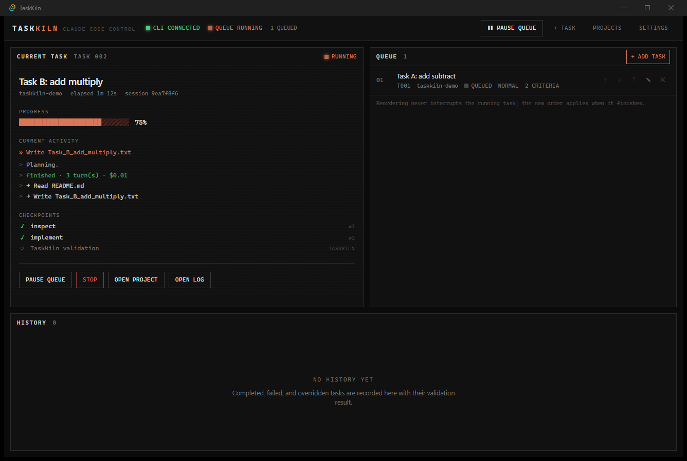
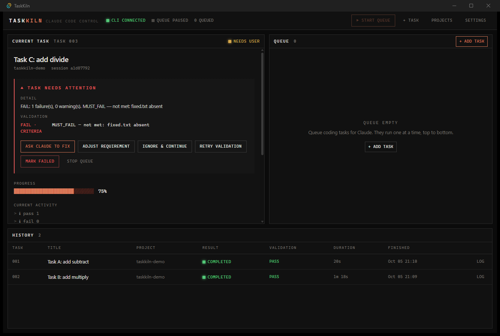
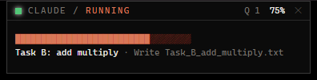

# TaskKiln

**Your coding agent keeps working. You stay in control.**

TaskKiln is a local desktop control center for [Claude Code](https://docs.claude.com/en/docs/claude-code). Queue several coding tasks against a local project, press **Start**, and TaskKiln has Claude work through them one by one. It checks every result before it moves on, and stops only when a human decision is actually needed.



| NEEDS USER intervention | Compact status bar |
| --- | --- |
|  |  |

> **Current scope: Claude Code only.** Other agents (Codex, etc.) are on the roadmap but are not supported yet.

---

## What it does

1. You pick one or more local project directories.
2. You queue tasks. Each task has a **title**, a **description** and **acceptance criteria**. Claude can draft the criteria, and you edit them before anything runs.
3. On **Start queue**, TaskKiln launches the real `claude` CLI in the project directory for the first task:
   - **PLANNING**: Claude inspects the code read-only and returns a checkpoint plan as structured JSON.
   - **RUNNING**: Claude implements the task in the same session and reports checkpoints as it goes.
   - **TESTING**: TaskKiln runs the project's approved build, test and lint commands.
   - **VALIDATING**: TaskKiln inspects git changes, and a *separate*, read-only Claude session reviews every acceptance criterion against the actual code.
4. **PASS**: the task is marked COMPLETED and the next queued task starts automatically.
   **WARNING / FAIL**: the queue pauses and you get a notification. You then choose **Ask Claude to fix**, **Adjust requirement**, **Ignore & continue** or **Stop queue**.
5. Everything (queue, checkpoints, events, logs, validation results, settings) is stored in a local SQLite database, so a restart never loses state.

## Features

- Task queue with drag-and-drop ordering, keyboard-accessible move up/down, move-to-front, edit and delete.
- Live view of what Claude is doing: current tool call, streamed output, and the checkpoint list.
- **Honest progress**: progress is completed checkpoint weight divided by total weight. It never comes from timers or token counts. If Claude stops reporting checkpoints, the UI shows *Progress unavailable* rather than a made-up number.
- A validation engine that combines Claude's exit status, its structured completion report, permission denials, git changes, build/test/lint results and an independent criteria review.
- Intervention workflow. Fixes run in the same Claude session (`--resume`), and overrides are recorded in history as *completed with warning*.
- Crash recovery. Tasks that were active when TaskKiln exited are flagged **INTERRUPTED** and never assumed complete. You can Resume, Retry validation, Mark failed or Return to queue. The queue never restarts on its own after launch.
- Native desktop notifications for: task completed, queue completed, validation failed, Claude process failed, and user intervention required.
- A compact always-on-top status bar window (always-on-top can be turned off). Clicking it opens the control panel.
- An execution log per task with timestamped events, output and validation, with basic secret redaction.
- A first-run system check: Claude CLI detection, sign-in status and project selection.

## Requirements

| | |
| --- | --- |
| OS | Windows 10/11 or macOS. Linux should work but is untested. |
| Claude Code | `claude` CLI with `-p`, `--output-format stream-json`, `--session-id` and `--resume`. `--json-schema`, `--permission-prompts` and `--tools` are used when available. Developed against **2.1.286**. |
| Claude auth | Claude Code must already be signed in (`claude auth login`). TaskKiln never reads or stores credentials. |
| Node.js | 20+ (developed with 24) |
| Rust | stable (developed with 1.98), plus the [Tauri 2 prerequisites](https://v2.tauri.app/start/prerequisites/). On Windows that means the MSVC Build Tools and WebView2; on macOS, the Xcode Command Line Tools. |
| git | Recommended. It's needed for changed-file detection; without git, validation degrades gracefully. |

## Installation & development setup

```bash
git clone https://github.com/hannnnnnnny/TaskKiln.git
cd TaskKiln
npm install
```

Run the app in development mode:

```bash
npm run tauri dev
```

Build a release bundle (an installer for your OS lands in `src-tauri/target/release/bundle/`):

```bash
npm run tauri build
```

Run all checks (TypeScript, frontend tests, Rust tests):

```bash
npm run check
```

## How to use it

1. Launch TaskKiln. The system check shows **CLAUDE CLI: CONNECTED** once the CLI is found and signed in.
2. Choose a project directory. TaskKiln detects validation commands (see below) and asks you to **approve** each one before it will ever run it.
3. Click **+ Add task**. Enter a title, a description and acceptance criteria (one per line), or use **Generate with Claude**.
4. Order the queue, then press **▶ Start queue**.
5. Watch progress in the main window or the status bar. Answer any **NEEDS USER** prompts.

## How task execution works

TaskKiln invokes Claude Code directly. It never scrapes a terminal and never simulates responses. Each invocation is a separate child process:

```text
claude -p --output-format stream-json --verbose
       --session-id <uuid> | --resume <uuid>
       --permission-prompts none --permission-mode <setting>
       --json-schema <plan | completion | review schema>
       --allowedTools <...> --disallowedTools <...>
       (prompt is written to stdin)
```

- **Process safety.** Programs are spawned with argument vectors and no shell. Prompts go through stdin, so there are no command-line length or quoting issues. Each child runs inside a Windows Job Object (kill-on-close) or a Unix process group, so **Stop** and app exit terminate the whole process tree. On Windows, the job object also kills children if TaskKiln crashes.
- **Structured output.** Planning, completion reports and reviews use `--json-schema`, and TaskKiln reads `structured_output` from the final `result` event. On older CLIs it falls back to the last JSON object in the final message.
- **Live checkpoints.** The execution prompt asks Claude to print `TASKKILN_CHECKPOINT_START n` and `TASKKILN_CHECKPOINT_DONE n` lines, which TaskKiln parses from the stream. The completion report fills in any checkpoint that wasn't marked live.
- **Sessions.** The plan and execute steps share one Claude session, and fixes and reconcile runs resume it. If a session can't be resumed, TaskKiln logs `SESSION_RESUME_FAILED` and starts a new session with the full task context.
- **Capability detection.** `claude --help` is parsed at startup, and flags the installed version doesn't advertise are omitted. A CLI missing the required flags is reported as *UNSUPPORTED VERSION*.

## How validation works

| Signal | Effect |
| --- | --- |
| Claude process failed, timed out or returned an error result | FAIL (NEEDS USER, *Claude process failed*) |
| Completion report status `blocked` | FAIL |
| Completion report `partial`, remaining issues, or self-reported failing tests | WARNING |
| Approved **build** or **test** command fails | FAIL |
| Approved **lint** command fails | WARNING |
| Test checks enabled but no test command exists | WARNING |
| Detected command not yet approved | WARNING (the command is skipped, never run) |
| Git repo shows no changes attributable to the task | WARNING |
| Claude was denied a permission | WARNING |
| Reviewer: criterion `not_met` | FAIL |
| Reviewer: `partially_met` / `cannot_determine`, or review unavailable | WARNING |

Command detection reads:
- `package.json` scripts `build`, `test` and `lint`/`typecheck`, using npm/pnpm/yarn/bun based on the lockfile. npm's placeholder test script is ignored.
- `Cargo.toml`: `cargo build`, `cargo test`, `cargo clippy`.
- pytest configuration: `python -m pytest`. Ruff configuration: `ruff check .`.
- `go.mod`: `go build`, `go test`, `go vet`.

Commands run with `CI=true`, a 15-minute timeout and no shell.

Changed files are measured against a **git snapshot taken when the task first started**. Files you had already modified beforehand are not attributed to the task.

## Safety model

- Claude only runs inside the selected project directory, and the prompt forbids push, force-push, `reset --hard`, deleting the repository and `sudo`. The default `--disallowedTools` list enforces those rules at the CLI level: `git push`, `git reset --hard`, `git clean`, `rm -rf`, `sudo` and `git checkout --`.
- Runs are non-interactive with `--permission-prompts none`. Anything the permission mode doesn't allow is **denied**, never left hanging, and every denial appears in validation as a warning.
- The default permission mode is `acceptEdits`, combined with an allow-list for common build/test commands. `bypassPermissions` needs an explicit confirmation in Settings.
- TaskKiln itself never runs mutating git commands. It only uses `git status`, `git diff`, `git hash-object` and `git rev-parse`.
- Validation commands need explicit user approval per project.
- Destructive UI actions (stop task, delete task, remove project, mark failed, ignore validation, quit while running) ask for confirmation.
- Every process TaskKiln launches is recorded in the task's event log (`CLAUDE_STARTED`, `COMMAND_EXECUTED`).
- Output is sanitized before storage. API keys, GitHub/AWS/Slack tokens, bearer tokens, `*_TOKEN=`/`*_SECRET=`/`*_PASSWORD=` assignments and private-key headers are redacted.
- There is no privilege elevation, and TaskKiln never touches credentials.

## Data & privacy: local-first

- All TaskKiln data lives in one SQLite file in the OS app-data directory, e.g. `%APPDATA%\com.taskkiln.app\taskkiln.db` or `~/Library/Application Support/com.taskkiln.app/taskkiln.db`. The path is shown in Settings.
- There is no TaskKiln server, account or telemetry. The only network traffic is whatever Claude Code itself does.
- Removing a project from TaskKiln deletes its TaskKiln records only. Files on disk are never touched.

## Architecture

```text
src/                         React + TypeScript UI (Vite, Tailwind v4, Zustand)
  features/runner|queue|validation|history|projects|settings|setup|bar|log
  stores/app.ts              snapshot + live log state, fed by Tauri events
  lib/                       IPC wrappers, formatting, queue helpers (unit tested)
src-tauri/src/
  models/                    domain types + task state machine (transition table)
  db/                        SQLite repositories + migrations (user_version)
  process/                   spawn/stream/cancel; Job Object / process-group kill
  claude/                    CLI detection, capabilities, prompts, stream-json parsing, ClaudeRunner
  validation/                command detection, git inspection, verdict aggregation
  scheduler/                 core (pure decisions), engine (queue), pipeline (plan → run → test → validate)
  commands/                  Tauri IPC commands and window/OS integration
  notifications.rs           Tauri event emitter + native notifications
```

## Known limitations

- **Claude Code only.** Codex and other agents are not supported.
- One task runs at a time across all projects.
- Checkpoint progress depends on Claude printing checkpoint markers. If it stops, TaskKiln shows *Progress unavailable* rather than guessing.
- Moving a task to the front never interrupts the running task; the new order applies when it finishes. There is no "interrupt after current checkpoint".
- On Windows, a child is attached to its Job Object right after spawning, so grandchildren started within the first few milliseconds could in theory escape it.
- On macOS/Linux, a TaskKiln *crash* (rather than a normal stop or exit) can leave a Claude process running. The task is still flagged INTERRUPTED on restart.
- Resuming an interrupted task continues its Claude session but cannot recover output lost while TaskKiln was down.
- If the only Claude Code CLI available is the copy bundled inside the Claude desktop app, it must be signed in separately (`"<path>\claude.exe" auth login`). The system check shows the exact command.
- Validation can only be as good as the project's own build and tests, plus a model-based review. Treat PASS as strong evidence, not proof.
- Linux is untested.

## Roadmap

- Codex support
- Multiple coding agents behind an `AgentRunner` abstraction
- Enhanced validation: custom per-project commands, diff-based review heuristics, coverage
- Optional plugin integration
- Interrupt after the current checkpoint
- Parallel queues per project

## License

Apache-2.0. See [LICENSE](LICENSE).
